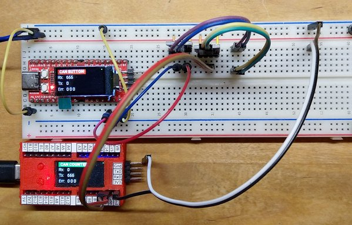

# CAN

Connect two Longan Nanos via two TJA1050 CAN bus driver modules



The ```Counter Longan``` counts and sends the value to the ```Button Longan``` which displays the received value.<br/>
The ```Button Longan``` checks the button state and sends the status to the ```Counter Longan```, which displays the received value and lights the LED accordingly.

The button message uses Standard ID 0x345, the count message uses Extended ID 0x1d22c405.

# Compile

When compiling specify the target with the ```-e``` option.

```
pio run -e counter -t upload
pio run -e button  -t upload
```

# Pin Mapping using alternative pins for CAN0

| Button      |         |  Counter |             |
| :---:       | :---:   | :---:    | :---:       |
| Longan Nano | TJA1050 | TJA 1050 | Longan Nano |
| 5V          | 5V      | 5V       | 5V          |
| Gnd         | Gnd     | Gnd      | Gnd         |
| B8          | Rx      | -        | -           |
| B9          | Tx      | -        | -           |
| -           | -       | Rx       | B8          |
| -           | -       | Tx       | B9          |
| -           | CAN H   | CAN H    | -           |
| -           | CAN L   | CAN L    | -           |

