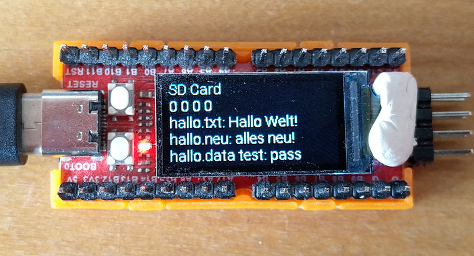

<h1>SdCard</h1>

This example uses the fatfs library from <a href="http://elm-chan.org/fsw/ff/00index_e.html">http://elm-chan.org/fsw/ff/00index_e.html</a>.

SdCard.cpp uses the library, and diskio.cpp provides the functions called by the library to access Logan Nano's SD card

<ol>
<li>Put a file "hallo.txt" with some text on an SD card, insert the card in the Longan Nano.</li>
<li>Run the program which
  <ul>
    <li>tries to read file "hallo.txt" and prints the content to the LCD screen
    <li>tries to read file "hallo.neu" and prints the content to the LCD screen (will fail on first run)</li>
    <li>writes the file "hallo.neu"</li>
    <li>writes data to the file "hallo.data", reads the data back and compares it with the original data</li>
  </ul>
</li>
<li>Press reset, to see the same results, but this time "hallo.new" will show some text</li>
</ol>

